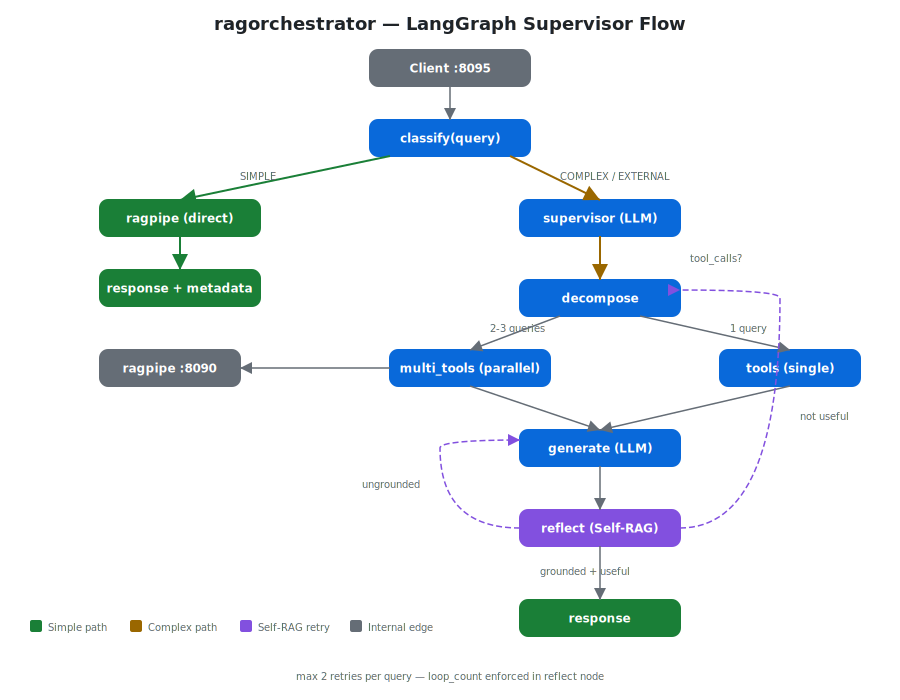

# ragorchestrator

LangGraph supervisor agent for [ragpipe](https://github.com/aclater/ragpipe) — agentic RAG orchestration with adaptive complexity routing, multi-pass retrieval, and Self-RAG reflection.



## Features

- **Adaptive complexity routing** — deterministic keyword classifier routes SIMPLE queries to ragpipe directly (~2s) and COMPLEX queries through the full agentic loop (~30-120s). See [classifier docs](docs/classifier.md).
- **Multi-pass retrieval** — complex queries are decomposed into sub-queries, retrieved in parallel from ragpipe, and deduplicated. See [multipass docs](docs/multipass.md).
- **Self-RAG reflection** — after generation, the supervisor grades its own response for groundedness and usefulness, retrying up to 2 times. See [self-rag docs](docs/self-rag.md).
- **ragpipe as a tool** — corpus retrieval with citations preserved end-to-end via LangGraph ToolNode.
- **OpenAI-compatible API** — same `/v1/chat/completions` schema as ragpipe. Switch by changing the port.
- **Sovereign deployment** — all LLM calls to local model, no external APIs. Optional Tavily web search.
- **Prometheus metrics** — query latency, tool call counts, complexity distribution.

## Quick start

```bash
# Prerequisites: ragpipe on :8090, LLM on :8080
pip install '.[dev]'
python -m ragorchestrator

# Simple query (fast path)
curl http://localhost:8095/v1/chat/completions \
  -H "Content-Type: application/json" \
  -d '{"model":"default","messages":[{"role":"user","content":"Who is Adam Clater?"}]}'

# Complex query (agentic path)
curl http://localhost:8095/v1/chat/completions \
  -H "Content-Type: application/json" \
  -d '{"model":"default","messages":[{"role":"user","content":"Compare NATO article 5 with patent claims requirements"}]}'
```

## Documentation

| Document | Description |
|----------|-------------|
| [Architecture](docs/architecture.md) | LangGraph supervisor design, state machine, request flow |
| [Classifier](docs/classifier.md) | Adaptive complexity routing — SIMPLE/COMPLEX/EXTERNAL |
| [Self-RAG](docs/self-rag.md) | Reflection grading, retry logic, short-circuit optimization |
| [Multi-pass](docs/multipass.md) | Query decomposition, parallel retrieval, deduplication |
| [API](docs/api.md) | Endpoints, request/response format, rag_metadata, streaming |
| [Configuration](docs/configuration.md) | Environment variables, IPv4 requirement, sovereign mode |

## Environment variables

| Variable | Default | Description |
|----------|---------|-------------|
| `MODEL_URL` | `http://127.0.0.1:8080` | LLM endpoint (must use IPv4) |
| `MODEL_NAME` | `model.file` | Model name for LangChain |
| `RAGPIPE_URL` | `http://localhost:8090` | ragpipe endpoint |
| `RAGPIPE_ADMIN_TOKEN` | | Bearer token for ragpipe |
| `RAGORCHESTRATOR_PORT` | `8095` | Listen port |
| `TAVILY_API_KEY` | | Tavily API key (optional, tool disabled if unset) |
| `DISABLE_WEB_SEARCH` | | Set to `true` for sovereign mode |

See [configuration docs](docs/configuration.md) for deployment details.

## Known limitations

- **Agentic path latency**: COMPLEX queries make 5+ sequential LLM calls (~30-120s with Qwen3-32B)
- **Web search disabled by default**: Set `TAVILY_API_KEY` and unset `DISABLE_WEB_SEARCH` to enable
- **IPv4 required**: `MODEL_URL` must use `127.0.0.1` not `localhost` on Fedora (IPv6 resolution issue)

## Health and metrics

```bash
curl http://localhost:8095/health     # {"status": "ok", "version": "0.1.0"}
curl http://localhost:8095/metrics    # Prometheus text format
```

## Tests

```bash
pip install '.[dev]'
python -m pytest tests/ -v           # unit tests
python -m pytest tests/ -v --live    # + live integration tests
```

## License

AGPL-3.0-or-later
