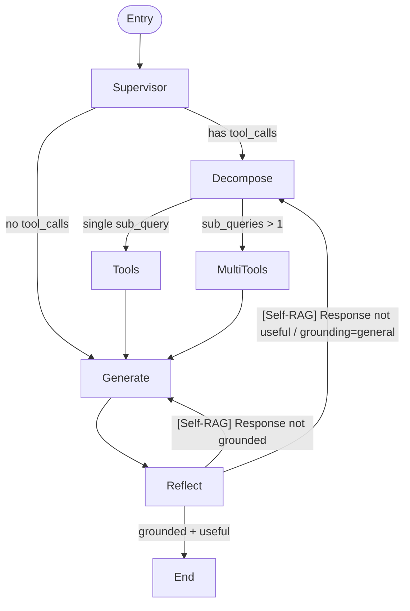

# LangGraph Supervisor Graph

ragorchestrator runs a LangGraph supervisor graph that implements adaptive complexity routing, Self-RAG reflection, and multi-pass retrieval.

## Graph Overview



## Nodes

### `supervisor` — LLM call
Routes the query to the appropriate execution path. Uses the `SUPERVISOR_PROMPT` which instructs the LLM to call `ragpipe_retrieval` for corpus questions. Decides whether to emit a tool call or generate directly.

**Pure Python:** Invokes `ChatOpenAI.bind_tools(tools)` — no tool execution here, just decides whether to call tools or generate.

### `decompose` — LLM call
Decomposes a complex query into 2-3 sub-queries using `decompose_query()` from `multipass.py`. The LLM is called with `DECOMPOSITION_PROMPT` to break down the question.

**Max retries:** Falls back to original query on LLM failure.

### `tools` — Tool execution (pure Python)
`ToolNode` bound to `[ragpipe_retrieval, web_search?]`. Executes the `ragpipe_retrieval` tool when the supervisor decides to call it. The `ragpipe_retrieval` tool calls ragpipe's `/v1/chat/completions` endpoint and returns a grounded answer with citations.

**Pure Python:** `ToolNode` is a LangGraph primitive that routes tool calls to their implementations.

### `multi_tools` — async Python (ragpipe only)
Parallel retrieval for multiple sub-queries. Calls `ragpipe_retrieval` for each sub-query in `asyncio.gather()`, deduplicates results via `deduplicate_documents()`. Web search is NOT called in multi-pass mode — multi-pass is corpus-only.

**Pure Python:** No LLM call. Pure async HTTP calls to ragpipe.

### `generate` — LLM call
Generates an answer from the retrieved documents. Uses `GENERATION_PROMPT` (first pass) or `REGENERATION_PROMPT` (subsequent passes, includes previous answer for revision). Limits to top 5 documents.

**LLM call:** `ChatOpenAI(temperature=0).invoke()` with formatted documents.

### `reflect` — LLM call(s) conditionally
Self-RAG reflection node. Runs two sequential LLM calls:

1. **Hallucination grader** (`grade_hallucination`): Checks if generation is grounded in documents.
2. **Answer grader** (`grade_answer`): Checks if generation addresses the question.

**Short-circuit:** If `grounding=general` (no corpus match from ragpipe), skips hallucination grading entirely and goes straight to re-retrieval.

**Pure Python:** All other logic — grounding extraction, loop counting, message construction.

## Edge Conditions

### `should_retrieve` (supervisor → decompose | generate)
```python
if last_message.has_tool_calls:
    return "decompose"
return "generate"
```
If the supervisor LLM emitted tool calls, decompose the query. Otherwise, go straight to generation (for general-knowledge questions that need no retrieval).

### `should_use_multipass` (decompose → multi_tools | tools)
```python
if len(sub_queries) > 1:
    return "multi_tools"
return "tools"
```
If decomposition produced multiple sub-queries, retrieve for each in parallel. If only one sub-query, use single-pass `tools` node.

### `should_regenerate` (reflect → generate | decompose | END)
```python
if "[Self-RAG]" in last_message.content:
    if "regenerating" in content.lower():
        return "generate"       # re-generate with stricter prompt
    elif "re-retriev" in content.lower():
        return "decompose"      # re-retrieve with rewritten query
return END                     # grounded + useful — done
```
Interprets the `[Self-RAG]` message injected by `reflect()` to decide the next action.

## LLM Call Summary

| Node | LLM Call | Notes |
|------|----------|-------|
| `supervisor` | Yes | Decides tool use or direct generation |
| `decompose` | Yes | Query decomposition via LLM |
| `tools` | No | ToolNode — executes `ragpipe_retrieval` (HTTP, not LLM) |
| `multi_tools` | No | Async parallel HTTP calls to ragpipe |
| `generate` | Yes | Generation from documents |
| `reflect` | Conditional | 0, 1, or 2 LLM calls — hallucination + answer grading |

## Where ragpipe Is Called

ragpipe is called exclusively via the `ragpipe_retrieval` LangGraph tool in two places:

1. **`tools` node** (single-pass): For simple single-tool-call retrieval.
2. **`multi_tools` node** (parallel): For multi-pass parallel retrieval across sub-queries.

ragpipe is NOT called directly from `supervisor` — it flows through the `ToolNode` bound to `[ragpipe_retrieval]`.

## DISABLE_WEB_SEARCH Effect

`DISABLE_WEB_SEARCH=true` (or `TAVILY_API_KEY` unset) affects the `tools` node:

```python
def _build_tools():
    tools = [ragpipe_retrieval]
    web_search = get_web_search_tool()  # returns None if TAVILY_API_KEY unset
    if web_search:
        tools.append(web_search)
    return tools
```

When `DISABLE_WEB_SEARCH=true`:
- The web search tool is not added to the tool list.
- The `supervisor` LLM still decides whether to call tools, but only `ragpipe_retrieval` is available.
- If the supervisor requests web search, the LLM falls back to `ragpipe_retrieval` or direct generation.

In sovereign/air-gapped mode (`DISABLE_WEB_SEARCH=true`), all queries go through ragpipe only — no external web search.

## State Schema

```python
class AgentState(TypedDict):
    messages: Annotated[list, add_messages]  # conversation history
    question: str                            # original user question
    generation: str                           # current generated answer
    documents: list                          # retrieved documents
    loop_count: int                          # Self-RAG retry counter (max 2)
```

## Max Retries

`MAX_RETRIES = 2` in `graph.py`. The graph will re-generate or re-retrieve at most once after an initial attempt. After 2 total attempts, `reflect` returns `END` regardless of grading.

## ragpipe grounding in Self-RAG

When `ragpipe_retrieval` returns `grounding=general` (no corpus match), the `reflect` node short-circuits the hallucination grader:

```python
if grounding == "general":
    # Skip hallucination grading — no corpus docs to grade against
    if loop_count >= MAX_RETRIES:
        return {"loop_count": loop_count + 1}
    return {"loop_count": loop_count + 1, "messages": [...]}
```

This avoids an LLM call that would always return "ungrounded" when there are no documents to check against.
